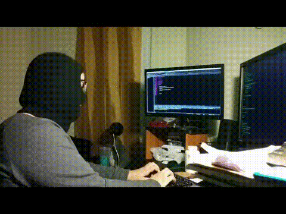

  

###

  
  

###

  

###

<h1 align="center">hey there 👋</h1>

###

<h3 align="left">👩‍💻  About Me</h3>

###

I'm unh00k3d from turkey  - 🔭 I’m working as independent software developer - 📚 I'm currently studying mathematical engineering at Yıldız Technical University - ⚡ In my free time I learn about computer vision and artificial intelligence

###

<h3 align="left">🛠 Language and tools</h3>

###

  
  
  
  
  
  
  
  
  
  
  
  
  
  
  
  
  
  
  

###

<h3 align="left">🔥   My Stats :</h3>

###

  

###

###
  

<h3 align="left">☕️   Coding I do in my spare time :</h3>

###

